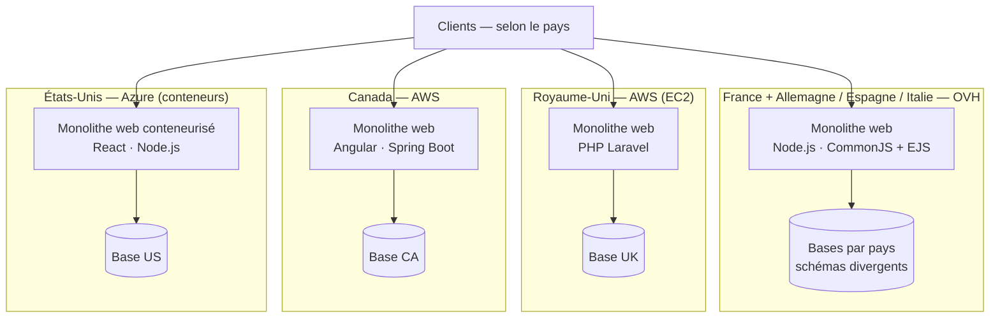

## 2. Audit de l'existant

### 2.1 Objet, périmètre et démarche

**Objet.** Cet audit transforme la *description technique de l'existant* en un **diagnostic
structuré**. Il identifie, pour le parc applicatif actuel de Your Car Your Way, ses **forces**, ses
**faiblesses** et ses **contraintes techniques**, et établit dans quelle mesure l'existant **valide
ou non** un ensemble de **critères de qualité** (§2.2) — sur la seule base des **faits et métriques**
communiqués par la description technique.

**Périmètre.** L'audit couvre les **quatre applications web** en production et leur **architecture
globale** :

- l'**application historique française** et ses déclinaisons **allemande, espagnole et italienne**
  (fondations techniques communes) ;
- l'**application britannique** (produit racheté) ;
- l'**application canadienne** ;
- l'**application états-unienne**.

Il porte sur l'**architecture** (par pays et globale), les **technologies** et leurs interactions, et
l'**état des lieux technique** documenté (fiabilité, sécurité, disponibilité). L'exploitation
physique en agence et les processus métier non outillés sont hors sujet.

**Démarche.** L'audit procède en quatre temps :

1. **lecture de l'architecture** globale et par pays — technologies, hébergement, interactions
   (§2.3) ;
2. **définition et rappel des critères** d'évaluation (§2.2) ;
3. **état des lieux** au regard des métriques disponibles (§2.4) ;
4. **conclusion** établissant, **critère par critère**, ce que l'existant valide ou non, et
   **pointant des directions de remédiation** — sans préjuger des choix d'architecture cible, qui
   relèvent des chapitres de proposition (frontière rappelée en §1.2).

**Limite méthodologique.** L'audit s'appuie **exclusivement** sur les éléments fournis par la
*description technique de l'existant* ; il ne procède ni à un test de charge, ni à une revue de code,
ni à un audit de sécurité instrumenté. Ses constats sont donc **étayés par les métriques disponibles**
et ne comportent **aucun jugement non documenté**.

### 2.2 Critères d'évaluation

L'existant est lu au travers de **six critères**. Trois sont **mis en avant par l'énoncé** comme axes
d'analyse prioritaires — **maintenabilité**, **performance**, **évolutivité** ; trois correspondent
aux **axes mesurés** par la description technique — **fiabilité**, **sécurité**, **disponibilité**.

Ces critères se **recoupent partiellement** : une même métrique peut en éclairer plusieurs (par
exemple, la charge maximale soutenable concerne à la fois la performance, l'évolutivité et la
disponibilité). Le **tableau d'indicateurs** ci-dessous fixe, pour chaque critère, les **indicateurs
mobilisés** — afin d'ancrer chaque constat dans un fait et d'éviter les doubles comptes.

**Définitions.**

- **Maintenabilité** — aptitude à comprendre, corriger et faire évoluer les applications et leur
  exploitation **sans surcoût croissant ni régression**. Couvre l'homogénéité des technologies, la
  duplication et la divergence du code, l'unification des API et des données, l'automatisation des
  déploiements et la dette technique.
- **Performance** — aptitude à traiter les requêtes dans des **temps et des taux d'erreur
  acceptables**, en charge nominale comme en pointe.
- **Évolutivité** — aptitude à **absorber de nouveaux besoins** (fonctionnels, nouveaux pays, montée
  en charge) **à coût maîtrisé** ; inclut la capacité de mise à l'échelle (scalabilité) et la
  modularité.
- **Fiabilité** — aptitude à **fonctionner correctement dans la durée** et à **se rétablir après
  incident** : continuité de service, qualité des livraisons, sauvegardes restaurables.
- **Sécurité** — niveau de **protection des données et des accès** : robustesse de l'authentification
  stockée, chiffrement des échanges, gestion des secrets, exposition aux vulnérabilités connues.
- **Disponibilité** — proportion de temps où le service est **opérationnel** et **résilient** à la
  panne et à la charge : redondance, indisponibilité subie, comportement en pic.

**Indicateurs mobilisés par critère.**

| Critère | Ce que l'on évalue | Indicateurs mobilisés (source : description technique de l'existant) |
|---|---|---|
| **Maintenabilité** | Homogénéité, duplication, unification, automatisation, dette | Hétérogénéité des stacks (FR/DE/ES/IT, UK, CA, US) ; code copié-adapté et divergence progressive ; API « limitées, hétérogènes, non unifiées » ; une base par pays à schémas divergents ; déploiements manuels (OVH) ; dette technique (TLS 1.0, SHA-1) |
| **Performance** | Débit et taux d'erreur sous charge | Charge maximale sans dégradation (≈ 150 → 350 req/s) ; taux d'erreur lors des pics saisonniers (0,8 → 4 %) |
| **Évolutivité** | Capacité à croître en charge et en périmètre | Architecture 100 % monolithique ; containerisation (US uniquement) ; redondance / réplication ; écart de charge soutenable entre pays ; absence d'unification technique |
| **Fiabilité** | Continuité de service et rétablissement | Taux de disponibilité sur 12 mois (97,2 → 98,9 %) ; MTTR (OVH ≈ 2 h 45 / cloud ≈ 1 h 10) ; taux de réussite des déploiements (82 % / 91 %) ; délai de stabilisation post-release (3,4 j / 1,7 j) ; backups et tests de restauration |
| **Sécurité** | Protection des données et des accès | Hachage des mots de passe (SHA-1 / bcrypt / argon2id) ; TLS 1.0 résiduel (FR, IT) ; gestion des secrets (fichiers de config OVH, variables d'environnement AWS, KeyVault partiel) ; dépendances vulnérables (11 → 41 % des packages) |
| **Disponibilité** | Opérabilité et résilience | Temps d'indisponibilité mensuel (7 → 28 min) ; redondance / réplication (aucune / partielle / containerisé) ; charge maximale soutenable ; taux d'erreur en pic ; politique de backups |

> **Convention de rattachement.** Trois indicateurs éclairent plusieurs critères : la *charge
> maximale*, le *taux d'erreur en pic* et le *taux de disponibilité*. Ils sont **analysés une seule
> fois** sous leur critère principal — **performance** pour la charge et le taux d'erreur,
> **fiabilité** pour le taux de disponibilité sur 12 mois — puis **rappelés** lorsqu'ils éclairent un
> autre critère (évolutivité, disponibilité), **sans être recomptés**.

La **conclusion de l'audit** (§2.5) reprendra ces six critères un à un pour statuer, métriques à
l'appui, sur leur **validation** par l'existant.

### 2.3 Architecture de l'existant

Your Car Your Way exploite aujourd'hui **quatre applications web distinctes**, issues de contextes
historiques différents, **développées indépendamment**, avec des **technologies hétérogènes** et
**sans stratégie d'unification technique**. L'architecture repose principalement sur des **monolithes
web** déployés dans des environnements variés. Cette section **décrit** cet existant ; son **analyse**
au regard des critères (§2.2) intervient en §2.4 et §2.5.

#### 2.3.1 Architectures par pays

| Famille | Contexte | Technologies | Hébergement / déploiement | Particularités (selon la description) |
|---|---|---|---|---|
| **France** (+ Allemagne, Espagne, Italie) | Première version du produit, base technique la plus ancienne ; DE / ES / IT en sont des déclinaisons | Backend **Node.js** ; frontend **CommonJS + EJS** ; **monolithe complet** (authentification, catalogue, réservation, paiement) | Serveurs **OVH** ; **déploiements manuels** | Base fonctionnelle riche mais **vieillissante** ; DE / ES / IT reposent sur les mêmes fondations, **code dérivé du cœur FR** souvent copié-adapté → **divergence progressive** ; fonctionnalités parfois différentes selon le pays (règles métier locales) |
| **Royaume-Uni** | **Rachat** d'un produit existant | **PHP Laravel** | **AWS**, instances **EC2** classiques | Application plus récente mais **isolée** ; **différences fortes** sur le modèle de données et les règles de réservation |
| **Canada** | Nouveau développement visant à **moderniser la stack** ; d'après la description, le résultat **n'a pas été à la hauteur** des attentes | Frontend **Angular** ; backend **Spring Boot** | **AWS**, architecture plus moderne | **Meilleure expérience utilisateur** ; première tentative d'unification visuelle, **restée locale** |
| **États-Unis** | Mise à l'essai d'une **nouvelle stack** à l'occasion de ce projet | Frontend **React** ; backend **Node.js** | **Azure** (App Services / conteneurs) | **Seule application conteneurisée** ; projet plus ambitieux mais **jamais généralisé** aux autres pays |

#### 2.3.2 Architecture globale

Au-delà des quatre familles, la description relève quatre traits transverses :

- **Style dominant** : **100 % monolithes web** — **aucun microservice**.
- **API** : **limitées, hétérogènes, non unifiées**.
- **Données** : **chaque pays possède sa propre base**, aux **schémas divergents**.
- **Partage d'information** : **inexistant**, ou réalisé par des **échanges manuels**.

#### 2.3.3 Cartographie de l'existant

La figure ci-dessous synthétise le paysage : quatre piles applicatives indépendantes, chacune avec sa
propre base, sans socle commun.

**Figure 1 — Cartographie de l'existant.**

**Alternative textuelle (Figure 1).** Le schéma représente **quatre applications web indépendantes**,
une par marché national, **sans composant partagé** entre elles :

- **France + Allemagne / Espagne / Italie** — un monolithe web **Node.js** (frontend CommonJS + EJS),
  hébergé chez **OVH**, avec une **base par pays** aux schémas divergents ;
- **Royaume-Uni** — un monolithe web **PHP Laravel**, hébergé sur **AWS (EC2)**, avec sa propre base ;
- **Canada** — un monolithe web **Angular + Spring Boot**, hébergé sur **AWS**, avec sa propre base ;
- **États-Unis** — un monolithe web **conteneurisé React + Node.js**, hébergé sur **Azure**, avec sa
  propre base.

Chaque application sert les clients de son pays et dispose de sa **propre base**. Il n'existe **aucune
API unifiée** ni **socle commun** entre les applications ; le **partage d'information** est
**inexistant** ou réalisé par des **échanges manuels**.
