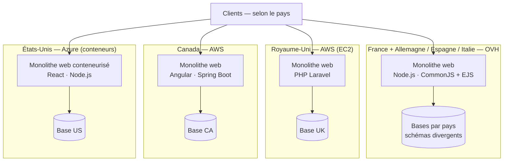

## 2. Audit de l'existant

### 2.1 Objet, périmètre et démarche

**Objet.** Cet audit transforme la *description technique de l'existant* en un **diagnostic
structuré**. Il identifie, pour le parc applicatif actuel de Your Car Your Way, ses **forces**, ses
**faiblesses** et ses **contraintes techniques**, et établit dans quelle mesure l'existant **valide
ou non** un ensemble de **critères de qualité** (§2.2) — sur la seule base des **faits et métriques**
communiqués par la description technique.

**Périmètre.** L'audit couvre les **quatre applications web** en production et leur **architecture
globale** :

- l'**application historique française** et ses déclinaisons **allemande, espagnole et italienne**
  (fondations techniques communes) ;
- l'**application britannique** (produit racheté) ;
- l'**application canadienne** ;
- l'**application états-unienne**.

Il porte sur l'**architecture** (par pays et globale), les **technologies** et leurs interactions, et
l'**état des lieux technique** documenté (fiabilité, sécurité, disponibilité). L'exploitation
physique en agence et les processus métier non outillés sont hors sujet.

**Démarche.** L'audit procède en quatre temps :

1. **lecture de l'architecture** globale et par pays — technologies, hébergement, interactions
   (§2.3) ;
2. **définition et rappel des critères** d'évaluation (§2.2) ;
3. **état des lieux** au regard des métriques disponibles (§2.4) ;
4. **conclusion** établissant, **critère par critère**, ce que l'existant valide ou non, et
   **pointant des directions de remédiation** — sans préjuger des choix d'architecture cible, qui
   relèvent des chapitres de proposition (frontière rappelée en §1.2).

**Limite méthodologique.** L'audit s'appuie **exclusivement** sur les éléments fournis par la
*description technique de l'existant* ; il ne procède ni à un test de charge, ni à une revue de code,
ni à un audit de sécurité instrumenté. Ses constats sont donc **étayés par les métriques disponibles**
et ne comportent **aucun jugement non documenté**.

### 2.2 Critères d'évaluation

L'existant est lu au travers de **six critères**. Trois sont **mis en avant par l'énoncé** comme axes
d'analyse prioritaires — **maintenabilité**, **performance**, **évolutivité** ; trois correspondent
aux **axes mesurés** par la description technique — **fiabilité**, **sécurité**, **disponibilité**.

Ces critères se **recoupent partiellement** : une même métrique peut en éclairer plusieurs (par
exemple, la charge maximale soutenable concerne à la fois la performance, l'évolutivité et la
disponibilité). Le **tableau d'indicateurs** ci-dessous fixe, pour chaque critère, les **indicateurs
mobilisés** — afin d'ancrer chaque constat dans un fait et d'éviter les doubles comptes.

**Définitions.**

- **Maintenabilité** — aptitude à comprendre, corriger et faire évoluer les applications et leur
  exploitation **sans surcoût croissant ni régression**. Couvre l'homogénéité des technologies, la
  duplication et la divergence du code, l'unification des API et des données, l'automatisation des
  déploiements et la dette technique.
- **Performance** — aptitude à traiter les requêtes dans des **temps et des taux d'erreur
  acceptables**, en charge nominale comme en pointe.
- **Évolutivité** — aptitude à **absorber de nouveaux besoins** (fonctionnels, nouveaux pays, montée
  en charge) **à coût maîtrisé** ; inclut la capacité de mise à l'échelle (scalabilité) et la
  modularité.
- **Fiabilité** — aptitude à **fonctionner correctement dans la durée** et à **se rétablir après
  incident** : continuité de service, qualité des livraisons, sauvegardes restaurables.
- **Sécurité** — niveau de **protection des données et des accès** : robustesse de l'authentification
  stockée, chiffrement des échanges, gestion des secrets, exposition aux vulnérabilités connues.
- **Disponibilité** — proportion de temps où le service est **opérationnel** et **résilient** à la
  panne et à la charge : redondance, indisponibilité subie, comportement en pic.

**Indicateurs mobilisés par critère.**

| Critère | Ce que l'on évalue | Indicateurs mobilisés (source : description technique de l'existant) |
|---|---|---|
| **Maintenabilité** | Homogénéité, duplication, unification, automatisation, dette | Hétérogénéité des stacks (FR/DE/ES/IT, UK, CA, US) ; code copié-adapté et divergence progressive ; API « limitées, hétérogènes, non unifiées » ; une base par pays à schémas divergents ; déploiements manuels (OVH) ; dette technique (TLS 1.0, SHA-1) |
| **Performance** | Débit et taux d'erreur sous charge | Charge maximale sans dégradation (≈ 150 → 350 req/s) ; taux d'erreur lors des pics saisonniers (0,8 → 4 %) |
| **Évolutivité** | Capacité à croître en charge et en périmètre | Architecture 100 % monolithique ; containerisation (US uniquement) ; redondance / réplication ; écart de charge soutenable entre pays ; absence d'unification technique |
| **Fiabilité** | Continuité de service et rétablissement | Taux de disponibilité sur 12 mois (97,2 → 98,9 %) ; MTTR (OVH ≈ 2 h 45 / cloud ≈ 1 h 10) ; taux de réussite des déploiements (82 % / 91 %) ; délai de stabilisation post-release (3,4 j / 1,7 j) ; backups et tests de restauration |
| **Sécurité** | Protection des données et des accès | Hachage des mots de passe (SHA-1 / bcrypt / argon2id) ; TLS 1.0 résiduel (FR, IT) ; gestion des secrets (fichiers de config OVH, variables d'environnement AWS, KeyVault partiel) ; dépendances vulnérables (11 → 41 % des packages) |
| **Disponibilité** | Opérabilité et résilience | Temps d'indisponibilité mensuel (7 → 28 min) ; redondance / réplication (aucune / partielle / containerisé) ; charge maximale soutenable ; taux d'erreur en pic ; politique de backups |

> **Convention de rattachement.** Trois indicateurs éclairent plusieurs critères : la *charge
> maximale*, le *taux d'erreur en pic* et le *taux de disponibilité*. Ils sont **analysés une seule
> fois** sous leur critère principal — **performance** pour la charge et le taux d'erreur,
> **fiabilité** pour le taux de disponibilité sur 12 mois — puis **rappelés** lorsqu'ils éclairent un
> autre critère (évolutivité, disponibilité), **sans être recomptés**.

La **conclusion de l'audit** (§2.5) reprendra ces six critères un à un pour statuer, métriques à
l'appui, sur leur **validation** par l'existant.

### 2.3 Architecture de l'existant

Your Car Your Way exploite aujourd'hui **quatre applications web distinctes**, issues de contextes
historiques différents, **développées indépendamment**, avec des **technologies hétérogènes** et
**sans stratégie d'unification technique**. L'architecture repose principalement sur des **monolithes
web** déployés dans des environnements variés. Cette section **décrit** cet existant ; son **analyse**
au regard des critères (§2.2) intervient en §2.4 et §2.5.

#### 2.3.1 Architectures par pays

| Famille | Contexte | Technologies | Hébergement / déploiement | Particularités (selon la description) |
|---|---|---|---|---|
| **France** (+ Allemagne, Espagne, Italie) | Première version du produit, base technique la plus ancienne ; DE / ES / IT en sont des déclinaisons | Backend **Node.js** ; frontend **CommonJS + EJS** ; **monolithe complet** (authentification, catalogue, réservation, paiement) | Serveurs **OVH** ; **déploiements manuels** | Base fonctionnelle riche mais **vieillissante** ; DE / ES / IT reposent sur les mêmes fondations, **code dérivé du cœur FR** souvent copié-adapté → **divergence progressive** ; fonctionnalités parfois différentes selon le pays (règles métier locales) |
| **Royaume-Uni** | **Rachat** d'un produit existant | **PHP Laravel** | **AWS**, instances **EC2** classiques | Application plus récente mais **isolée** ; **différences fortes** sur le modèle de données et les règles de réservation |
| **Canada** | Nouveau développement visant à **moderniser la stack** ; d'après la description, le résultat **n'a pas été à la hauteur** des attentes | Frontend **Angular** ; backend **Spring Boot** | **AWS**, architecture plus moderne | **Meilleure expérience utilisateur** ; première tentative d'unification visuelle, **restée locale** |
| **États-Unis** | Mise à l'essai d'une **nouvelle stack** à l'occasion de ce projet | Frontend **React** ; backend **Node.js** | **Azure** (App Services / conteneurs) | **Seule application conteneurisée** ; projet plus ambitieux mais **jamais généralisé** aux autres pays |

#### 2.3.2 Architecture globale

Au-delà des quatre familles, la description relève quatre traits transverses :

- **Style dominant** : **100 % monolithes web** — **aucun microservice**.
- **API** : **limitées, hétérogènes, non unifiées**.
- **Données** : **chaque pays possède sa propre base**, aux **schémas divergents**.
- **Partage d'information** : **inexistant**, ou réalisé par des **échanges manuels**.

#### 2.3.3 Cartographie de l'existant

La figure ci-dessous synthétise le paysage : quatre piles applicatives indépendantes, chacune avec sa
propre base, sans socle commun.

**Figure 1 — Cartographie de l'existant.**

**Alternative textuelle (Figure 1).** Le schéma représente **quatre applications web indépendantes**,
une par marché national, **sans composant partagé** entre elles :

- **France + Allemagne / Espagne / Italie** — un monolithe web **Node.js** (frontend CommonJS + EJS),
  hébergé chez **OVH**, avec une **base par pays** aux schémas divergents ;
- **Royaume-Uni** — un monolithe web **PHP Laravel**, hébergé sur **AWS (EC2)**, avec sa propre base ;
- **Canada** — un monolithe web **Angular + Spring Boot**, hébergé sur **AWS**, avec sa propre base ;
- **États-Unis** — un monolithe web **conteneurisé React + Node.js**, hébergé sur **Azure**, avec sa
  propre base.

Chaque application sert les clients de son pays et dispose de sa **propre base**. Il n'existe **aucune
API unifiée** ni **socle commun** entre les applications ; le **partage d'information** est
**inexistant** ou réalisé par des **échanges manuels**.

### 2.4 État des lieux technique

Cette section **synthétise les métriques** de la description technique, **critère par critère** : elle
établit les **faits** et **ce qu'ils signifient** techniquement. Elle ne **statue pas** encore sur la
validation des critères — ce **verdict** relève de la conclusion (§2.5). Chaque constat est
**identifié `AUD-NN`** et **renvoie à un chiffre** de la description.

Les métriques font apparaître un **clivage récurrent** entre un **socle historique** — FR / DE / ES /
IT, hébergé chez OVH — et des **applications plus récentes** — UK, CA, US, sur AWS / Azure ;
l'application **US**, seule conteneurisée, présente le plus souvent les **meilleures métriques**. Ce
clivage structure la lecture ci-dessous. Conformément à la **convention de rattachement** (§2.2), la
*charge*, le *taux d'erreur* et le *taux de disponibilité* sont analysés une fois sous leur critère
principal, puis **rappelés** sans être recomptés.

#### 2.4.1 Maintenabilité

- **`AUD-01` — Hétérogénéité technologique du parc.** Quatre piles distinctes coexistent : Node.js +
  CommonJS/EJS (FR/DE/ES/IT), PHP Laravel (UK), Angular + Spring Boot (CA), React + Node.js (US),
  **sans socle commun**. Autant de chaînes d'outils, de compétences et de cycles de mise à jour à
  entretenir en parallèle.
- **`AUD-02` — Duplication et divergence du code.** Les déclinaisons **DE, ES, IT** sont un **code
  dérivé du cœur FR**, « copié / adapté », d'où une **divergence progressive** et des **règles métier
  différentes selon le pays** : une même correction doit être reportée à la main sur plusieurs bases
  de code.
- **`AUD-03` — Fragmentation des données et des API.** **Une base par pays**, aux **schémas
  divergents** ; des API « **limitées, hétérogènes, non unifiées** » ; un **partage d'information
  inexistant ou manuel**. Aucune source de vérité commune entre les pays.

> *Effet mesuré en aval* : l'absence d'automatisation de la livraison sur le socle historique
> (déploiements **manuels**, OVH) se lit dans les métriques de fiabilité — réussite des déploiements
> et délai de stabilisation (`AUD-07`).

#### 2.4.2 Performance

- **`AUD-04` — Charge maximale soutenable hétérogène.** Sans dégradation : **≈ 150 req/s**
  (FR/DE/ES/IT), **≈ 250** (UK), **≈ 300** (CA), **≈ 350** (US). Le socle historique plafonne à
  **moins de la moitié** de la capacité de l'application US, pour une même nature de service.
- **`AUD-05` — Taux d'erreur en pic saisonnier.** Lors des pics (vacances) : **jusqu'à 4 %**
  (FR/DE/ES/IT), **1,5 %** (UK/CA), **0,8 %** (US). L'écart de robustesse sous charge suit le clivage
  historique / récent.

#### 2.4.3 Évolutivité

- **`AUD-06` — Aptitude à la mise à l'échelle contrainte par l'architecture.** Le parc est à **100 %
  monolithique** (aucun microservice) ; **une seule application est conteneurisée** (US) ; la
  **réplication** est **nulle** (FR/DE/ES/IT) ou **partielle** (UK/CA). Absorber une montée en charge
  ou un nouveau pays dépend donc de la mise à l'échelle verticale de chaque monolithe — le **plafond
  de charge** (`AUD-04`, rappelé) matérialise cette limite côté historique.

#### 2.4.4 Fiabilité

- **`AUD-07` — Réussite et stabilisation des livraisons.** Réussite des déploiements : **82 %** sur le
  socle historique (**OVH, manuel**) contre **91 %** sur le cloud. Délai de stabilisation après mise à
  jour : **3,4 jours** (FR/DE/ES/IT) contre **1,7 jour** (UK/CA/US). La chaîne de livraison historique
  échoue davantage et met **environ deux fois plus de temps** à se stabiliser.
- **`AUD-08` — Continuité et rétablissement.** Disponibilité moyenne sur 12 mois : **97,2 %**
  (FR/DE/ES/IT) → **98,1 %** (CA) → **98,6 %** (UK) → **98,9 %** (US). MTTR : **≈ 2 h 45** sur OVH
  contre **≈ 1 h 10** sur AWS / Azure. Le socle historique subit plus d'indisponibilité et **récupère
  plus lentement**.
- **`AUD-09` — Sauvegardes et restauration.** FR/DE/ES/IT : backups **manuels**, 1 ×/jour,
  **restauration non testée** ; UK/CA : snapshots quotidiens AWS, **pas de tests réguliers** ; US :
  sauvegardes Azure automatisées, **restauration testée tous les 90 jours**. La capacité réelle à
  restaurer n'est **éprouvée que sur l'application US**.

#### 2.4.5 Sécurité

- **`AUD-10` — Hachage des mots de passe hétérogène.** **SHA-1** sur FR/DE/ES/IT (fonction
  **cryptographiquement obsolète** pour des mots de passe) ; **bcrypt** sur UK (cost 10) et US
  (strength 12) ; **argon2id** sur CA. Le socle historique stocke les mots de passe avec un algorithme
  déprécié.
- **`AUD-11` — Protocole de chiffrement hérité.** HTTPS est activé partout, mais **TLS 1.0** — version
  **dépréciée** — reste accepté sur **FR et IT** « pour compatibilité ».
- **`AUD-12` — Secrets en fichiers ou variables, sans rotation.** Secrets en **fichiers de
  configuration** sur le serveur OVH (FR/DE/ES/IT) ; **variables d'environnement** AWS **sans rotation
  automatisée** (UK/CA) ; **Azure KeyVault** utilisé **partiellement** (US, API seulement). Aucun pays
  n'a une gestion des secrets complète.
- **`AUD-13` — Dépendances vulnérables.** Part des packages présentant des vulnérabilités connues :
  **41 %** (FR), **35–40 %** (DE/ES/IT), **18 %** (UK), **22 %** (CA), **11 %** (US). L'exposition
  décroît du socle historique vers les applications récentes.

> Ces constats de sécurité forment le **socle factuel** des exigences de sécurité exprimées au cahier
> des charges (livrable 1, §7).

#### 2.4.6 Disponibilité

- **`AUD-14` — Indisponibilité mensuelle.** Temps moyen d'indisponibilité : **21 à 28 min**
  (FR/DE/ES/IT), **9 à 16 min** (UK/CA), **7 min** (US). Le socle historique est **trois à quatre
  fois** plus souvent indisponible que l'application US.
- **`AUD-15` — Redondance variable.** **Aucune réplication** des instances applicatives sur
  FR/DE/ES/IT ; **réplication partielle** sur UK/CA ; US **conteneurisé** mais **base non redondante**.
  Sur le socle historique, la **panne d'une instance interrompt le service** (point de défaillance
  unique) ; la *charge* et le *taux d'erreur en pic* (`AUD-04` / `AUD-05`, rappelés) pèsent davantage
  là où il n'y a pas de redondance.

#### 2.4.7 Synthèse des constats

| Constat | Critère | Fait établi (chiffre) |
|---|---|---|
| `AUD-01` | Maintenabilité | 4 piles technologiques distinctes, sans socle commun |
| `AUD-02` | Maintenabilité | Cœur FR copié-adapté en 3 déclinaisons (DE / ES / IT) |
| `AUD-03` | Maintenabilité | 1 base par pays (schémas divergents) ; API non unifiées |
| `AUD-04` | Performance | Charge max : 150 → 350 req/s (historique → US) |
| `AUD-05` | Performance | Erreurs en pic : 4 % → 0,8 % |
| `AUD-06` | Évolutivité | 100 % monolithes ; 1 conteneurisé ; réplication nulle / partielle |
| `AUD-07` | Fiabilité | Déploiements 82 % / 91 % ; stabilisation 3,4 j / 1,7 j |
| `AUD-08` | Fiabilité | Dispo 12 mois 97,2 → 98,9 % ; MTTR 2 h 45 / 1 h 10 |
| `AUD-09` | Fiabilité | Restauration éprouvée seulement sur US (tous les 90 j) |
| `AUD-10` | Sécurité | SHA-1 (historique) vs bcrypt / argon2id (récents) |
| `AUD-11` | Sécurité | TLS 1.0 résiduel (FR, IT) |
| `AUD-12` | Sécurité | Secrets : fichiers / env sans rotation / KeyVault partiel |
| `AUD-13` | Sécurité | Dépendances vulnérables : 11 % → 41 % |
| `AUD-14` | Disponibilité | Indisponibilité mensuelle : 7 → 28 min |
| `AUD-15` | Disponibilité | Réplication nulle / partielle ; base US non redondante |

Le **verdict critère par critère** — l'existant **valide-t-il** chacun de ces critères ? — ainsi que
la lecture en **forces / faiblesses / contraintes** et les **directions de remédiation** font l'objet
de la **conclusion** (§2.5).

### 2.5 Conclusion de l'audit

**Constat central.** Le problème dominant de l'existant **n'est pas la charge** : la volumétrie est
**soutenue sans dégradation** partout (`AUD-04`, 150 → 350 req/s) et la **disponibilité reste
correcte** (`AUD-14`, 7 → 28 min d'indisponibilité mensuelle). Le problème est celui de la
**cohérence et de la maintenabilité** : **hétérogénéité** des technologies (`AUD-01`), **duplication**
et **divergence** du code (`AUD-02`), **fragmentation des données** (`AUD-03`), aggravées par une
**dette de sécurité** sur le socle historique (`AUD-10`→`AUD-13`). C'est sur ces axes structurants —
et non sur la capacité — que l'existant ne tient pas.

#### 2.5.1 Verdict critère par critère

| Critère | Verdict | Justification (constats, chiffres) |
|---|---|---|
| **Maintenabilité** | **Non validé** | `AUD-01` (4 piles sans socle commun), `AUD-02` (cœur FR copié-adapté en DE/ES/IT), `AUD-03` (une base par pays, API non unifiées) |
| **Performance** | **Validé** — réserve sur le socle historique | `AUD-04` (charge soutenue, 150 → 350 req/s), `AUD-05` (erreurs en pic 0,8 → 4 %) : acceptable, plus faible sur FR/DE/ES/IT |
| **Évolutivité** | **Non validé** | **Cause première** : `AUD-01` (4 piles divergentes, sans socle commun) et `AUD-03` (données fragmentées, API non unifiées) — toute extension (nouveau pays, nouvelle fonction) se duplique sur des socles séparés. **Facteur secondaire** : `AUD-06` (des monolithes **cloisonnés, non unifiés et peu réplicables** — 1 seul conteneurisé, réplication nulle/partielle) |
| **Fiabilité** | **Partiellement validé** | continuité correcte (`AUD-08` : 97,2 → 98,9 %, MTTR 2 h 45 / 1 h 10) ; **point faible** : livraison historique (`AUD-07` : 82 %, 3,4 j) et restauration non éprouvée hors US (`AUD-09`) |
| **Sécurité** | **Non validé** | `AUD-10` (SHA-1), `AUD-11` (TLS 1.0), `AUD-12` (secrets en fichiers / sans rotation), `AUD-13` (jusqu'à 41 % de dépendances vulnérables) |
| **Disponibilité** | **Validé** — réserve sur le socle historique | `AUD-14` (indisponibilité mensuelle modeste, 7 → 28 min) ; réserve : `AUD-15` (redondance nulle/partielle, base US non redondante) |

En lecture nuancée : **deux critères runtime** (performance, disponibilité) sont **globalement
satisfaits**, surtout sur UK/CA/US et perfectibles sur le socle historique ; la **fiabilité est
inégale**, tirée vers le bas par la **livraison** ; **trois critères structurants** (maintenabilité,
évolutivité, sécurité) **ne sont pas satisfaits**.

#### 2.5.2 Forces, faiblesses et contraintes

**Forces.**

- Les **applications récentes** (UK/CA/US) offrent une **base saine** sur les axes runtime : charge
  250 → 350 req/s (`AUD-04`), erreurs 0,8 → 1,5 % (`AUD-05`), MTTR ≈ 1 h 10 (`AUD-08`),
  indisponibilité 7 → 16 min (`AUD-14`).
- Des **pratiques modernes existent déjà localement** : **argon2id** (CA), **conteneurisation** et
  **restauration testée** (US) (`AUD-09`, `AUD-10`).
- La **charge n'est pas un facteur de risque** : elle est soutenue partout (`AUD-04`).

**Faiblesses.**

- **Cohérence / maintenabilité** : hétérogénéité (`AUD-01`), duplication (`AUD-02`), fragmentation des
  données (`AUD-03`).
- **Sécurité du socle historique** : SHA-1, TLS 1.0, secrets en fichiers, dépendances vulnérables
  (`AUD-10`→`AUD-13`).
- **Livraison et reprise** : déploiements manuels peu fiables et stabilisation lente (`AUD-07`),
  sauvegardes non éprouvées (`AUD-09`).
- **Évolutivité et résilience** : d'abord l'**éclatement du parc** — **piles divergentes** (`AUD-01`)
  et **données fragmentées** (`AUD-03`) — qui renchérit chaque évolution ; s'y ajoutent des
  **monolithes cloisonnés, non unifiés et peu réplicables** (`AUD-06`) et une **redondance absente sur
  le socle historique** (`AUD-15`).

**Contraintes** (à porter par la suite, sans préjuger de la solution).

- **Reprise des données** : des bases par pays aux **schémas divergents** (`AUD-03`) — toute
  convergence devra traiter la migration et la cohérence des données existantes.
- **Spécificités locales** : des **règles métier propres à chaque pays** (`AUD-02`) à préserver, comme
  la dimension internationale du produit.
- **Continuité d'exploitation** : un parc **en production multi-pays** — la transition devra se faire
  **sans rupture de service**.
- **Conformité** : des **données personnelles** (RGPD) présentes dans chaque base, à protéger lors de
  toute évolution.
- **Compétences** : des équipes habituées à des piles **hétérogènes** (`AUD-01`).

#### 2.5.3 Directions de remédiation

Ces directions énoncent **les problèmes à traiter** ; elles **ne choisissent pas** la solution — le
choix de l'architecture, des technologies et sa justification relèvent des **chapitres suivants**
(proposition) et du **registre des décisions**.

- **Unifier le socle technique et les données** pour résorber l'hétérogénéité, la duplication et la
  fragmentation (`AUD-01`, `AUD-02`, `AUD-03`) — c'est l'**enjeu prioritaire**.
- **Automatiser la livraison** (intégration et déploiement continus) et **éprouver les restaurations**
  pour fiabiliser et accélérer les mises en production (`AUD-07`, `AUD-09`).
- **Reprendre la dette de sécurité** : moderniser le **hachage** des mots de passe, retirer les
  **protocoles dépréciés**, **centraliser et faire tourner les secrets**, réduire les **dépendances
  vulnérables** (`AUD-10`→`AUD-13`).
- **Renforcer la résilience** là où la redondance manque (`AUD-15`).
- **Préparer la capacité d'évolution et de montée en charge** (`AUD-06`) — dont la **forme** relève de
  la proposition.

**Mise en perspective.** La priorité n'est **pas la capacité** — la charge est soutenue (`AUD-04`) et
la disponibilité correcte (`AUD-14`) — mais la **cohérence, la maintenabilité et la sécurité**. C'est
ce diagnostic qui **oriente** la proposition d'architecture cible, **objet des chapitres suivants**.
