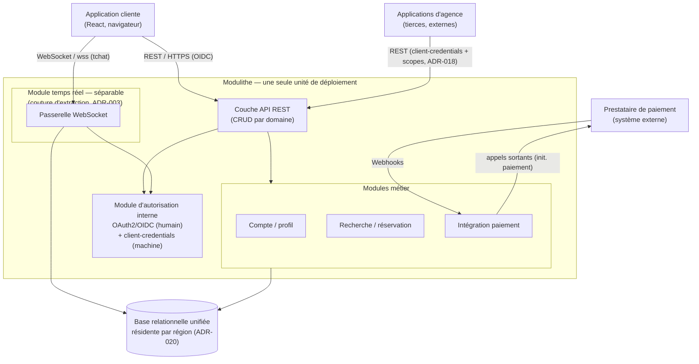
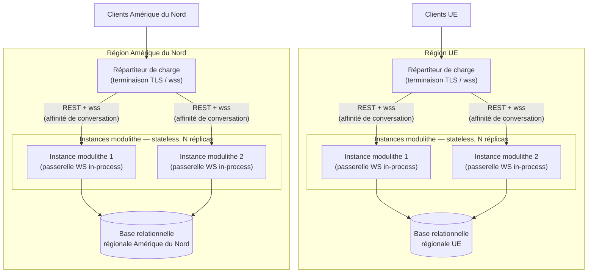

## 5. Architecture cible — vues de composants et de déploiement

Ce chapitre donne deux vues complémentaires de la cible : une **vue de composants** (les modules du
système et leurs interactions) et une **vue de déploiement** (les nœuds d'exécution, par région). Le
niveau reste le **cadrage** : on montre **quels composants, quelles interactions, quels nœuds**, et on
**relie chaque élément** au registre des décisions — pas le détail d'implémentation.

Chaque diagramme est en **Mermaid** et accompagné de son **alternative textuelle** (ADR-004).

### 5.1 Vue de composants

La figure 2 montre le système comme **un seul déployable — le modulithe** (ADR-003, ADR-019) — entouré
de ses **acteurs externes** : l'application cliente, les applications d'agence tierces et le
prestataire de paiement. Les **applications d'agence sont externes** : il n'y a **aucun back-office**
dans le périmètre (ADR-001).

**Figure 2 — Vue de composants.**

**Alternative textuelle (Figure 2).** Le schéma place **trois acteurs externes** autour d'un seul
bloc, le **modulithe** :

- l'**application cliente** (React, navigateur) ;
- les **applications d'agence tierces** (externes — pas de back-office) ;
- le **prestataire de paiement** (système externe).

Le **modulithe** (une seule unité de déploiement) contient :

- une **couche API REST** (CRUD par domaine), point d'entrée des appels HTTP ;
- un **module d'autorisation interne** servant les deux flux — **OAuth2/OIDC** pour l'humain,
  **client-credentials** pour la machine — **et non** un fournisseur d'identité déployé à part (cohérent
  §4.9) ;
- des **modules métier** : **compte / profil**, **recherche / réservation**, **intégration paiement** ;
- un **module temps réel séparable** (ADR-003) contenant la **passerelle WebSocket** ; il est dessiné
  comme **module interne** doté d'une **couture d'extraction** (frontière de module), **jamais** comme
  service flottant à part.

À l'extérieur du modulithe, une **base relationnelle unifiée**, **résidente par région** (ADR-020).

Les **interactions** étiquetées :

- application cliente → **couche API REST** en **REST / HTTPS** sous **OIDC** ;
- application cliente → **passerelle WebSocket** en **WebSocket / wss** (tchat) ;
- applications d'agence → **couche API REST** en **client-credentials + scopes** (ADR-018) ;
- prestataire de paiement → **module intégration paiement** par **webhooks** ; le module émet aussi des
  **appels sortants** vers le prestataire (initiation du paiement) ;
- la **couche API** et la **passerelle WebSocket** s'appuient sur le **module d'autorisation** ;
- les **modules métier** et la **passerelle** lisent / écrivent dans la **base relationnelle**.

La **passerelle temps réel inclut la persistance** des messages : le **module temps réel** porte son
propre domaine (`conversation` / `message` / `participant`) et **écrit en base**.

Le **paiement** et les **applications d'agence** sont des **composants tiers** : leur place et leurs
protocoles sont montrés ici ; le **détail de leur intégration** est traité au **chapitre 8** (C.1.7).

### 5.2 Vue de déploiement

La figure 3 montre **comment** le modulithe s'exécute. Elle est **délibérément régionale** (ADR-020) :
**chaque région** (UE, Amérique du Nord) déploie la **même architecture** — un **répartiteur de
charge** devant **N instances du même modulithe**, et une **base relationnelle régionale**. Les régions
sont **identiques en structure** ; seules **les données résident séparément**.

**Figure 3 — Vue de déploiement (par région).**

**Alternative textuelle (Figure 3).** Le schéma montre **deux régions à l'architecture identique**, UE
et Amérique du Nord. Dans **chaque** région :

- les **clients de la région** atteignent un **répartiteur de charge**, qui assure la **terminaison TLS
  / wss** en bordure ;
- le répartiteur distribue le trafic (REST **et** wss) vers **N instances du même modulithe**, un
  **tier stateless redondant** ;
- **chaque instance contient sa passerelle WebSocket *in-process*** — il n'y a **aucun nœud de
  passerelle séparé** : le modulithe reste **une seule unité de déploiement**, la séparabilité est une
  **frontière de module, pas de nœud** ;
- toutes les instances de la région partagent une **base relationnelle régionale**.

Les **données résident dans leur région** (ADR-020) ; la **structure** (répartiteur, instances, base)
est **la même** des deux côtés.

> **Périmètre — parcours transrégional.** Chaque client est servi par sa **région de résidence**.
> Réserver **hors de sa région** relèverait d'une **évolution** (fédération d'identité inter-région),
> **hors périmètre v1** : le **cloisonnement régional** imposé par le RGPD (ADR-020 / `NFR-RGPD-05`)
> **prime** sur ce confort, et rien dans le v0 ne le réclame.

#### 5.2.1 Redondance et mise à l'échelle — sur le tier stateless

Le **répartiteur + N instances** forment un **tier stateless** : on l'augmente par **mise à l'échelle
horizontale** (ajout d'instances) et on le **redonde**. Cela sert **deux NFR** à la fois :

- la **disponibilité ≥ 99,9 %/an** (`NFR-SLO-01`, ADR-017), en **supprimant le point de défaillance
  unique** du socle historique (`AUD-15`) : la panne d'une instance ne coupe plus le service ;
- la **capacité agrégée** (`NFR-SLO-06`, ADR-017) : unifier les marchés porte la **somme** des charges,
  absorbée par l'ajout d'instances — pas par une machine plus grosse (`AUD-04`).

La **base relationnelle** n'est **pas** la cible du *scaling* horizontal : elle est la **source de
vérité unifiée délibérée** (la re-fragmenter réintroduirait `AUD-03`). La charge étant **modeste**
(`AUD-04`), une **instance primaire + réplicas de lecture** — **dans la même région** (cohérent avec la
résidence ADR-020) — suffit ; la base **n'est pas un goulot**.

#### 5.2.2 Tension WebSocket multi-instance — résolution sobre

Un déploiement multi-instance soulève une objection légitime : *« si le Customer est servi par
l'instance 1 et l'Agent par l'instance 2, ils ne peuvent pas échanger »*. La résolution retenue est
**sobre** :

- **routage par affinité de conversation** au répartiteur : les **deux participants d'une même
  conversation** sont routés vers la **même instance** (par identifiant de conversation). La passerelle
  reste **in-process**, sans état partagé entre instances ;
- **aucun broker** (Redis, Kafka) : la volumétrie ne révèle **aucun problème de charge** (`AUD-04`) ;
  un broker serait de la **sur-ingénierie** ;
- la **couture d'extraction** (ADR-003) garde l'option ouverte : **si** la charge temps réel l'exigeait
  un jour, la passerelle pourrait être **extraite** avec un **backplane dédié** — **pas maintenant**.

**Reconnexion après coupure réseau.** La même **affinité de conversation** soutient la **reprise de
connexion** que le cahier des charges renvoie ici (US-CHAT-01, livrable 1) :

- en cas de **coupure réseau**, le **client** détecte la perte de connexion et **en informe
  l'utilisateur** (**dégradation gracieuse** : l'interface signale un état « reconnexion en cours »
  plutôt que d'échouer silencieusement) ;
- la **reconnexion** est **re-routée vers la même instance** par l'**affinité de conversation** — le
  mécanisme ci-dessus, appliqué à la reconnexion comme à la première connexion ;
- l'**historique** de la conversation est **rechargé depuis la persistance** (§5.1 ; ch.06 ; ch.07
  §7.4) : la reprise **ne perd aucun message**.

Le niveau reste le **cadrage** : on pose le **comportement** (détection, reprise ré-épinglée,
historique rechargé), pas un protocole de *heartbeat* ni de *backoff* chiffrés.

#### 5.2.3 Ce que l'on ne déploie pas (anti-sur-ingénierie)

On ne dessine **que ce que les NFR / SLO justifient**. Sont **délibérément absents** :

- **aucun fournisseur d'identité déployé à part** — l'autorisation est un **module interne** (§4.9) ;
- **aucun broker** de messages (cf. §5.2.2) ;
- **aucune passerelle d'API en produit séparé**, **aucun *service mesh*** : le modulithe expose
  directement son API REST derrière le répartiteur.

### 5.3 Rattachement au registre des décisions

| Élément d'architecture | Décision |
|---|---|
| Modulithe, une seule unité de déploiement ; module temps réel séparable (couture) | ADR-003 ; ADR-019 |
| Couche API REST CRUD par domaine ; applications d'agence externes (pas de back-office) | ADR-001 |
| Module d'autorisation interne — deux flux (OIDC humain / client-credentials machine) | ADR-002 ; ADR-018 |
| Base relationnelle unifiée | ADR-019 |
| Déploiement régional, données résidentes par région | ADR-020 |
| Redondance + scaling horizontal du tier stateless (disponibilité, capacité) | ADR-017 |

Les **composants tiers** (paiement, applications d'agence) sont **situés** ici ; le **détail de leur
intégration** — contrats, séquences, gestion des webhooks — relève du **chapitre 8** (C.1.7).
