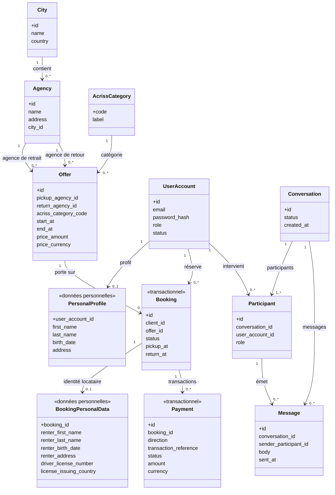

## 6. Modèle de données et de classes

Ce chapitre pose le **modèle de la cible** : une **vue de classes** des deux domaines (location et
tchat), la **machine à états** de la réservation, et un **schéma relationnel de cadrage**. Il est la
**source** de ce que la preuve de concept implémentera pour le tchat
(`conversation` / `message` / `participant`). Le niveau reste le **cadrage** : entités, attributs clés,
relations et contraintes importantes — **pas** un schéma de production exhaustif (index fins,
partitionnement : hors cadrage).

Chaque diagramme est en **Mermaid** et accompagné de son **alternative textuelle** (ADR-004).

### 6.1 Vue de classes

La figure 4 couvre **les deux domaines obligatoires** : le **domaine location** (Ville, Agence, Offre,
catégorie ACRISS, compte, réservation, paiement) et le **domaine tchat** (Conversation, Message,
Participant). Les entités **personnelles** (effaçables / anonymisables) et **transactionnelles**
(conservées) sont **annotées** — la séparation est détaillée en §6.2.



**Figure 4 — Vue de classes (domaines location et tchat).**

**Alternative textuelle (Figure 4).** Le schéma décrit deux domaines reliés par le **compte
utilisateur**.

**Domaine location :**

- **City** (ville : id, name, country) **contient** **0..n Agency** (chaque agence appartient à **une**
  ville — ADR-012) ;
- **Agency** (agence : id, name, address, city_id) est **point de retrait** et **point de retour** des
  offres : **deux relations distinctes** vers **Offer** — l'**agence de retrait** et l'**agence de
  retour** peuvent **différer** (aller simple, ADR-012) ;
- **AcrissCategory** (code ACRISS, label) **catégorise** les offres : la modélisation est au **niveau
  catégorie**, **pas** au véhicule à l'unité (ADR-008) ;
- **Offer** (offre : id, agence de retrait, agence de retour, catégorie ACRISS, **début / fin
  horodatés — date et heure** (`start_at` / `end_at`, v0), **price_amount + price_currency**) — ses
  villes sont **dérivées** des agences ;
- **UserAccount** (compte : id, email, password_hash, role, status) — `role` distingue **client** et
  **agent de support** (RBAC, ADR-002) ;
- **PersonalProfile** *(données personnelles)* : **0..1** par compte (identité du titulaire :
  first_name, last_name, birth_date, address) ;
- **Booking** *(transactionnel)* : id, client_id, offer_id, **status**, pickup_at, return_at — **0..n**
  par client, **portant sur** une offre ;
- **BookingPersonalData** *(données personnelles)* : **0..1** par réservation — **identité du locataire**
  et **permis** (driver_license_number, license_issuing_country : donnée réglementée, ADR-013) ;
- **Payment** *(transactionnel)* : **0..n** par réservation (un paiement initial, plus d'éventuels
  compléments / remboursements liés aux modifications — ADR-011) : **direction** (`charge` | `refund`),
  **transaction_reference** opaque, **status**, **amount + currency** — **aucune donnée de carte**
  (§6.4).

**Domaine tchat :**

- **Conversation** (id, status, created_at) regroupe **1..n Participant** ;
- **Participant** (id, conversation_id, user_account_id, **role** = customer | agent) relie un
  **compte** à une conversation ;
- **Message** (id, conversation_id, sender_participant_id, body, sent_at) : **0..n** par conversation,
  **émis** par un participant.

L'**isolation de conversation** (un participant n'accède qu'à **ses** conversations) repose sur la
relation **Participant → Conversation**.

### 6.2 Séparation données personnelles / transactionnelles (RGPD)

Le modèle doit rendre possible — exigence **ADR-010** — d'**effacer / anonymiser les données
personnelles** d'un client **tout en conservant** les **données transactionnelles** (réservation,
facturation) sous forme **anonymisée**, pour la durée légale. La structure y répond par une
**séparation explicite des entités** :

| Nature | Entités | Comportement à la suppression de compte |
|---|---|---|
| **Personnel** (effaçable / anonymisable) | `PersonalProfile`, `BookingPersonalData`, et l'`email` du `UserAccount` | **Anonymisés / effacés** : profil supprimé, identité du locataire et **numéro de permis** anonymisés, e-mail remplacé par un jeton anonyme |
| **Transactionnel** (conservé) | `Booking`, `Payment` | **Conservés** sous forme **anonymisée** : la ligne de réservation / facturation **survit** (montant, devise, dates, statut, référence de transaction) **sans** rattachement à une personne identifiable |

Le point clé : les données personnelles **ne sont pas** un bloc fondu dans la réservation ; elles
vivent dans des **entités dédiées** (`BookingPersonalData` en **0..1** de `Booking`). On peut donc
**anonymiser `BookingPersonalData`** et **détacher / pseudonymiser `client_id`** **sans détruire**
`Booking` ni `Payment`. Le **droit à l'effacement** et la **conservation légale** coexistent — sans
contradiction.

### 6.3 Machine à états de la réservation

La figure 5 formalise le cycle de vie de la réservation (ADR-011 / ADR-014). Les transitions sont
**étiquetées par leur déclencheur**.

```mermaid
stateDiagram-v2
  [*] --> EnAttentePaiement : création de la réservation
  EnAttentePaiement --> Confirmee : paiement confirmé (webhook)
  EnAttentePaiement --> Annulee : abandon avant paiement
  Confirmee --> Modifiee : modification autorisée (> 48 h ; ajustement tarifaire via prestataire)
  Modifiee --> Modifiee : nouvelle modification (> 48 h)
  Confirmee --> Terminee : clôture au retour du véhicule (API agence, ADR-014)
  Modifiee --> Terminee : clôture au retour du véhicule (API agence, ADR-014)
  Confirmee --> Annulee : annulation (matrice de remboursement, ADR-011)
  Modifiee --> Annulee : annulation (matrice de remboursement, ADR-011)
  Confirmee --> NoShow : non-présentation au retrait — bascule système à l'expiration du créneau (0 %)
  Modifiee --> NoShow : non-présentation au retrait — bascule système à l'expiration du créneau (0 %)
  Terminee --> [*]
  Annulee --> [*]
  NoShow --> [*]
```



**Figure 5 — Machine à états de la réservation.**

**Alternative textuelle (Figure 5).** La réservation naît en **EnAttentePaiement** (à sa création).
Transitions :

- **EnAttentePaiement → Confirmee** : sur **paiement confirmé** (notifié par **webhook** du
  prestataire) ;
- **EnAttentePaiement → Annulee** : **abandon avant paiement** ;
- **Confirmee → Modifiee** : **modification autorisée** (> 48 h avant le début ; un **ajustement
  tarifaire** — complément ou remboursement partiel — transite par le prestataire, ADR-011) ;
  **Modifiee → Modifiee** pour une nouvelle modification ;
- **Confirmee / Modifiee → Terminee** : **clôture au retour du véhicule**, déclenchée par une
  **application d'agence via l'API** (ADR-014) ;
- **Confirmee / Modifiee → Annulee** : **annulation**, soumise à la **matrice de remboursement**
  (ADR-011 : 100 % > 1 semaine ; 25 % entre 1 semaine et 48 h ; 0 % ≤ 48 h) ;
- **Confirmee / Modifiee → NoShow** : **non-présentation du client au retrait** — **bascule automatique
  du système** à l'**expiration du créneau de retrait** (no-show, **0 %**).

**Terminee**, **Annulee** et **NoShow** sont des états **terminaux**. Le déclencheur de **Confirmee**
est un **webhook de paiement**, mais l'état et la **référence** restent **agnostiques au prestataire**
(§6.4).

**Annulation avant vs après paiement — sans état supplémentaire.** Les deux chemins d'annulation
aboutissent au **même statut `cancelled`** ; ce qui les distingue n'est **pas l'état** mais la
**présence ou l'absence de `Payment`**, choix **délibérément sobre** (pas d'état dédié) :

- **abandon avant paiement** (`EnAttentePaiement → Annulee`) : **aucun `Payment`** n'existe → **rien à
  rembourser** ;
- **annulation après paiement** (`Confirmee` / `Modifiee → Annulee`) : un ou des `Payment` de
  **direction `charge`** existent → la **matrice de remboursement ADR-011** s'applique et se **matérialise
  par un `Payment` de direction `refund`** (montant selon le palier : 100 % / 25 % / 0 %).

De même, une **modification tarifaire** (`Confirmee → Modifiee`, ADR-011) se traduit par un nouveau
`Payment` lié à la **même** réservation : **`charge`** si le tarif **augmente**, **`refund`** si le
tarif **baisse**.

### 6.4 Paiement agnostique au prestataire

Le **mécanisme** de paiement est arrêté en **ADR-021** (collecte hébergée par le prestataire,
confirmation par webhook authentifié, prestataire = **instance réversible**) ; le **modèle de données
reste agnostique du prestataire** — c'est précisément ce qu'**ADR-021 confirme**, sans rouvrir ce
chapitre. Le modèle est **délibérément indépendant** du prestataire :

- `Payment` stocke une **direction** (`charge` | `refund`), une **référence de transaction opaque**
  (identifiant rendu par le prestataire), un **statut** et un **montant + devise** — ce qui rend
  **représentables** le **complément** (charge) et le **remboursement** (refund) d'une modification
  (ADR-011) ;
- **aucune donnée de carte** n'est stockée — **PCI-DSS délégué** au prestataire (`NFR-SEC-05`) ;
- le choix **Stripe / Adyen / autre** **ne change ni `Booking` ni `Payment`** : seul le **détail des
  webhooks** (chapitre 7) en dépendra.

### 6.5 Schéma relationnel (DDL de cadrage)

Le schéma ci-dessous fixe **tables, colonnes clés, clés étrangères et contraintes importantes**. Il
reste au **grain cadrage** ; les `conversation` / `participant` / `message` sont le **substrat repris
par la PoC**. Types donnés en convention PostgreSQL (ADR-019).

```sql
-- Domaine location ---------------------------------------------------------
CREATE TABLE city (
  id        BIGINT PRIMARY KEY,
  name      TEXT NOT NULL,
  country   TEXT NOT NULL
);

CREATE TABLE agency (
  id        BIGINT PRIMARY KEY,
  name      TEXT NOT NULL,
  address   TEXT NOT NULL,
  city_id   BIGINT NOT NULL REFERENCES city(id)
);

CREATE TABLE acriss_category (
  code      CHAR(4) PRIMARY KEY,          -- norme ACRISS (catégorie, pas véhicule)
  label     TEXT NOT NULL
);

CREATE TABLE offer (
  id                   BIGINT PRIMARY KEY,
  pickup_agency_id     BIGINT NOT NULL REFERENCES agency(id),
  return_agency_id     BIGINT NOT NULL REFERENCES agency(id),  -- peut différer (aller simple)
  acriss_category_code CHAR(4) NOT NULL REFERENCES acriss_category(code),
  start_at             TIMESTAMPTZ NOT NULL,                   -- date ET heure de départ (v0) ; UTC + offset conservé
  end_at               TIMESTAMPTZ NOT NULL,                   -- date ET heure de retour (v0)
  price_amount         NUMERIC(12,2) NOT NULL,
  price_currency       CHAR(3) NOT NULL,                       -- ISO 4217, devise explicite
  CHECK (end_at >= start_at)
);

CREATE TABLE user_account (
  id            BIGINT PRIMARY KEY,
  email         TEXT NOT NULL UNIQUE,      -- donnée personnelle (anonymisée à l'effacement)
  password_hash TEXT NOT NULL,             -- argon2id (NFR-SEC-01)
  role          TEXT NOT NULL CHECK (role IN ('client','support_agent')),
  status        TEXT NOT NULL
);

-- Données personnelles (effaçables / anonymisables) ------------------------
CREATE TABLE personal_profile (
  user_account_id BIGINT PRIMARY KEY REFERENCES user_account(id),
  first_name      TEXT,
  last_name       TEXT,
  birth_date      DATE,
  address         TEXT
);

-- Transactionnel (conservé, anonymisable sans destruction) -----------------
CREATE TABLE booking (
  id         BIGINT PRIMARY KEY,
  client_id  BIGINT REFERENCES user_account(id),  -- détachable à l'anonymisation
  offer_id   BIGINT NOT NULL REFERENCES offer(id),
  status     TEXT NOT NULL   -- 'cancelled' = abandon avant paiement (aucun payment) OU annulation après (matrice ADR-011) ; cf. §6.3
             CHECK (status IN
               ('pending_payment','confirmed','modified','cancelled','completed','no_show')),
  pickup_at  TIMESTAMPTZ NOT NULL,                 -- UTC + offset conservé (référence ADR-011)
  return_at  TIMESTAMPTZ NOT NULL
);

CREATE TABLE booking_personal_data (
  booking_id              BIGINT PRIMARY KEY REFERENCES booking(id),
  renter_first_name       TEXT,
  renter_last_name        TEXT,
  renter_birth_date       DATE,
  renter_address          TEXT,
  driver_license_number   TEXT,    -- donnée réglementée (ADR-013), anonymisable
  license_issuing_country TEXT
);

CREATE TABLE payment (
  id                    BIGINT PRIMARY KEY,
  booking_id            BIGINT NOT NULL REFERENCES booking(id),
  direction             TEXT NOT NULL CHECK (direction IN ('charge','refund')),  -- charge (paiement / complément) ou remboursement (ADR-011)
  transaction_reference TEXT NOT NULL UNIQUE,  -- référence opaque (aucune carte) ; UNIQUE = clé d'idempotence du webhook (ADR-021)
  status                TEXT NOT NULL,
  amount                NUMERIC(12,2) NOT NULL,                -- montant positif ; le sens est porté par direction
  currency              CHAR(3) NOT NULL                       -- ISO 4217
);

-- Domaine tchat (substrat repris par la PoC) -------------------------------
CREATE TABLE conversation (
  id         BIGINT PRIMARY KEY,
  status     TEXT NOT NULL,
  created_at TIMESTAMPTZ NOT NULL
);

CREATE TABLE participant (
  id              BIGINT PRIMARY KEY,
  conversation_id BIGINT NOT NULL REFERENCES conversation(id),
  user_account_id BIGINT NOT NULL REFERENCES user_account(id),
  role            TEXT NOT NULL CHECK (role IN ('customer','agent')),
  UNIQUE (conversation_id, user_account_id)
);

CREATE TABLE message (
  id                    BIGINT PRIMARY KEY,
  conversation_id       BIGINT NOT NULL REFERENCES conversation(id),
  sender_participant_id BIGINT NOT NULL REFERENCES participant(id),
  body                  TEXT NOT NULL,
  sent_at               TIMESTAMPTZ NOT NULL                   -- UTC
);
```

### 6.6 Justification des choix de structuration

- **Catégorie ACRISS, pas véhicule à l'unité** (ADR-008) : offres et réservations sont modélisées au
  **niveau catégorie** ; la gestion du parc à l'unité relève de l'exploitation en agence, **hors
  périmètre**. `offer` référence `acriss_category`, jamais un véhicule.
- **Séparation personnel / transactionnel** (ADR-010) : entités personnelles **dédiées**
  (`personal_profile`, `booking_personal_data`) **détachables** du transactionnel (`booking`,
  `payment`) — c'est ce qui rend l'**effacement RGPD** compatible avec la **conservation légale**
  (§6.2).
- **Agence de retrait ≠ agence de retour** (ADR-012) : **deux clés étrangères** distinctes sur `offer`
  autorisent l'**aller simple** ; la recherche **ville → agences → offres** s'appuie sur
  `agency.city_id`.
- **Paiement agnostique** (`NFR-SEC-05`) : `payment` ne porte qu'une **direction** + **référence
  opaque** + statut + montant / devise (§6.4).
- **Sens du paiement** (ADR-011) : la colonne **`direction` (`charge` | `refund`)** rend
  **représentables** le **complément** (charge) et le **remboursement** (refund) d'une modification
  tarifaire, sur la **même** réservation — le montant reste positif, le sens est porté par `direction`.
- **Annulation sans état surnuméraire** (ADR-011) : `cancelled` couvre **abandon avant paiement** et
  **annulation après** ; la distinction (rien à rembourser vs matrice de remboursement) est portée par
  la **présence / absence de `Payment`**, pas par un état dédié (§6.3) — choix de **sobriété**.
- **Multi-devise** (`NFR-I18N-02`) : `price_currency` et `payment.currency` **explicites** (ISO 4217) —
  jamais de devise implicite.
- **Horodatage sans ambiguïté** (§3.3) : `pickup_at` / `return_at` / `sent_at` en `TIMESTAMPTZ` (UTC +
  offset conservé) — support de la **référence temporelle** de la matrice ADR-011 (début de location).

### 6.7 Rattachement au registre et substrat de la PoC

| Élément du modèle | Décision |
|---|---|
| Catégorie ACRISS (pas de véhicule à l'unité) | ADR-008 |
| Séparation personnel / transactionnel | ADR-010 |
| Machine à états + matrice de remboursement | ADR-011 |
| Ville → Agence → Offre ; retrait ≠ retour | ADR-012 |
| Identité locataire + permis (donnée réglementée) | ADR-013 |
| Clôture *confirmée → terminée* via API agence | ADR-014 |
| Référentiel relationnel unifié (types, SGBD) | ADR-019 |
| Paiement agnostique au prestataire (`charge` / `refund`) | ADR-021 |

> **Substrat de la PoC.** Les tables **`conversation`**, **`participant`** et **`message`** sont
> **exactement** la structure que la preuve de concept **met en œuvre** pour le tchat —
> satisfaisant l'exigence **C.1.6** (structure de données mise en œuvre dans la PoC). L'**isolation de
> conversation** y est portée par la relation **`participant` → `conversation`** (un participant
> n'accède qu'à ses conversations).
>
> **Granularité assumée.** Le schéma `conversation` / `participant` est **volontairement générique** :
> il supporte **N participants** par conversation. La règle « **Customer + Agent**, deux côtés » de la
> PoC (ADR-006) est une **contrainte applicative**, **pas** une contrainte de schéma — le modèle reste
> **extensible** (p. ex. conversation à plusieurs intervenants) sans changer la structure.
>
> **Deux vocabulaires de rôle, par conception.** `user_account.role` (`client` / `support_agent`) et
> `participant.role` (`customer` / `agent`) sont **distincts à dessein** : le premier est le rôle du
> **compte** (RBAC, ADR-002), le second le rôle du **siège** tenu dans une conversation. La projection
> de l'un vers l'autre est une **règle applicative** — celle que la PoC implémente par la fonction pure
> `deriveSeatRole` (`client` → `customer`, `support_agent` → `agent`).

**Anti-sur-ingénierie.** Modèle de **cadrage** : pas d'historisation fine, pas de table de
journalisation au niveau schéma (la traçabilité `NFR-SEC-06` est une **exigence**, pas une table
détaillée ici), pas d'index / partitionnement de production, et **aucune entité hors périmètre**
(assurances, options, conducteur additionnel = **évolution**, ADR-013).
