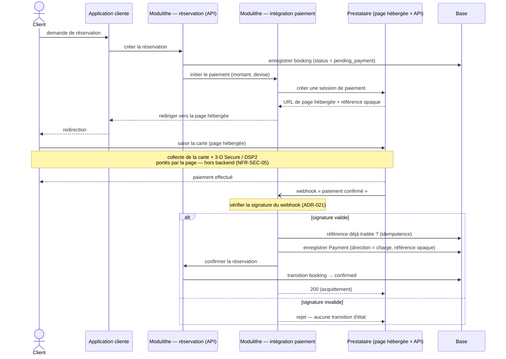
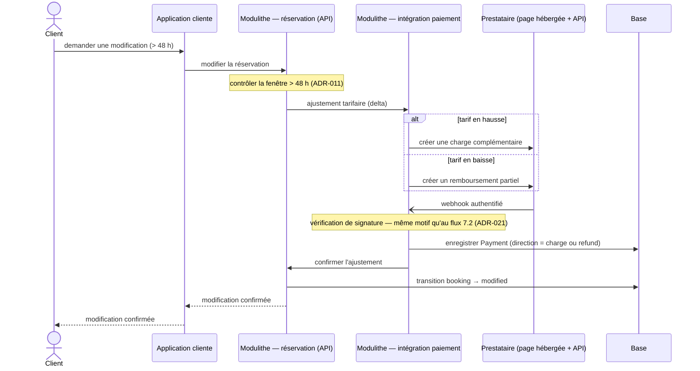
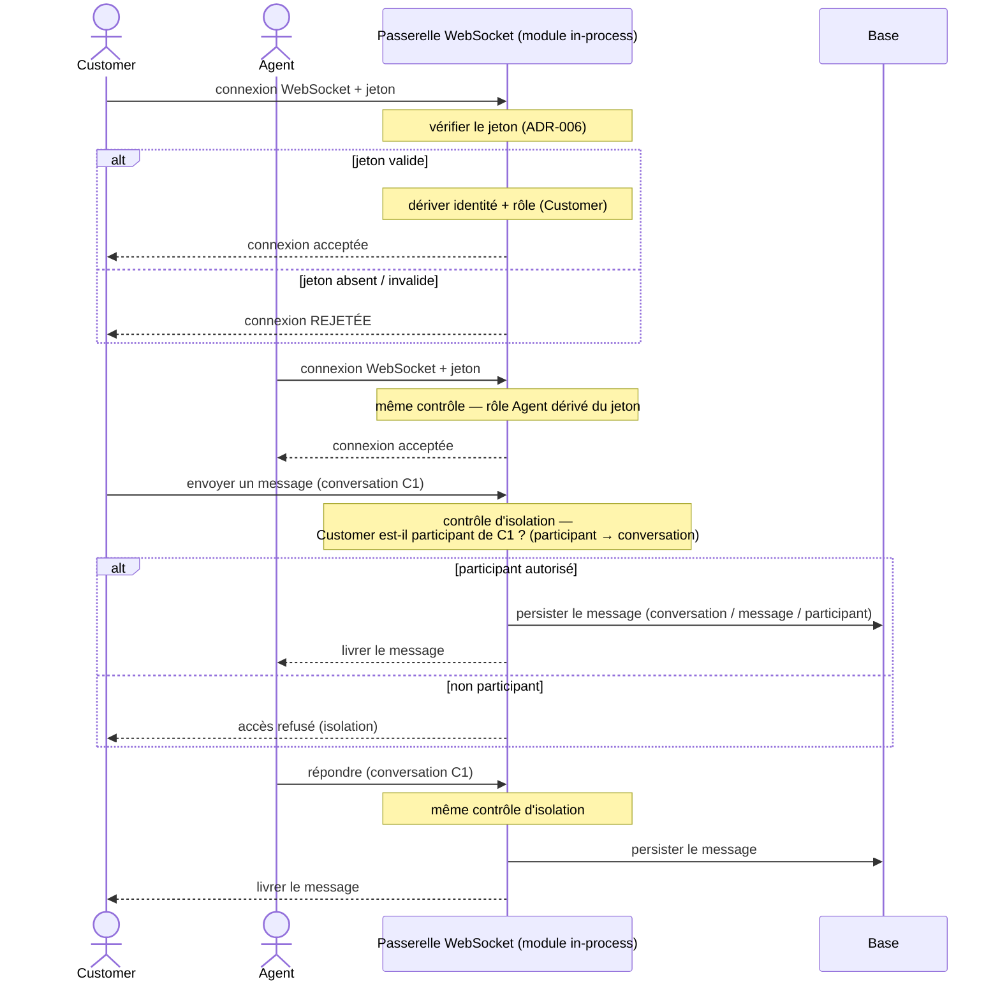

## 7. Vues dynamiques (diagrammes de séquence)

Ce chapitre montre **comment les composants interagissent dans le temps** sur les **flux porteurs** de
la cible. Le niveau reste le **cadrage** : on séquence les **enchaînements structurants**, pas le détail
d'implémentation.

Chaque diagramme est en **Mermaid** et accompagné de son **alternative textuelle** (ADR-004).

### 7.1 Périmètre — flux porteurs uniquement

L'indicateur attendu est « **composants et interactions** », **pas** un catalogue exhaustif de
séquences. Sont donc séquencés **trois flux porteurs**, et **seulement** ceux-là :

1. **réservation → paiement → webhook → confirmation** (§7.2) ;
2. **modification tarifaire** (§7.3) ;
3. **tchat — handshake authentifié, échange, isolation** (§7.4).

Ne sont **pas** séquencés — ce sont des enchaînements CRUD ordinaires sans interaction structurante à
démontrer : inscription / connexion, recherche d'offres, consultation de profil, déconnexion, ainsi que
les variantes d'erreur secondaires. Les **composants tiers** (prestataire de paiement) apparaissent ici
par leur **interaction** ; le **détail des contrats** d'intégration relève du **chapitre 8**.

### 7.2 Réservation → paiement → confirmation

Flux central. Le paiement est **externalisé** : la carte ne transite **jamais** par le *backend*
(`NFR-SEC-05`) et le webhook de confirmation n'est honoré **qu'après vérification de sa signature**
(ADR-021).

**Figure 6 — Réservation, paiement et confirmation.**

**Alternative textuelle (Figure 6).** Participants : **Client**, **Application cliente**, **Modulithe —
réservation (API)**, **Modulithe — intégration paiement**, **Prestataire (page hébergée + API)**,
**Base**.

Ordre des échanges :

1. le **Client** demande une réservation à l'**Application cliente**, qui la transmet au module
   **réservation** ;
2. le module **réservation** enregistre la réservation en base au statut **`pending_payment`** (ch.06) ;
3. il demande au module **intégration paiement** d'**initier le paiement** (montant, devise) ;
4. le module **intégration paiement** crée une **session** chez le **prestataire**, qui renvoie une
   **URL de page hébergée** et une **référence opaque** ;
5. le Client est **redirigé** vers la **page hébergée** du prestataire et y **saisit sa carte** ; la
   **collecte de la carte** et l'**authentification forte 3-D Secure / DSP2** sont **portées par cette
   page**, **hors du backend** (`NFR-SEC-05`) ;
6. le prestataire envoie, de façon asynchrone, un **webhook « paiement confirmé »** au module
   **intégration paiement**.

**Point de décision — vérification de la signature du webhook** (ADR-021) :

- **si la signature est valide** : le module vérifie d'abord que la **référence n'a pas déjà été
  traitée** (**idempotence**, contre les re-livraisons), enregistre un **`Payment` de direction
  `charge`** (référence opaque), demande la **confirmation** de la réservation — qui **transite vers
  `confirmed`** — puis **acquitte** (200) le prestataire ;
- **si la signature est invalide** : l'appel est **rejeté**, **aucune transition d'état** n'a lieu (un
  `confirmed` ne peut donc pas être forgé).

### 7.3 Modification tarifaire

Séquence courte (ADR-011). Elle **réutilise le motif du webhook vérifié** du flux précédent — elle ne le
re-détaille pas.

**Figure 7 — Modification tarifaire.**

**Alternative textuelle (Figure 7).** Participants : identiques à la figure 6.

Ordre des échanges :

1. le **Client** demande une **modification** (plus de 48 h avant le début) ; le module **réservation**
   **contrôle la fenêtre > 48 h** (ADR-011) ;
2. le module **réservation** demande un **ajustement tarifaire** (delta) au module **intégration
   paiement** ;
3. **selon le sens** : si le tarif **augmente**, le module crée une **charge complémentaire** chez le
   prestataire ; s'il **baisse**, un **remboursement partiel** ;
4. le prestataire renvoie un **webhook authentifié** ; sa **signature est vérifiée** selon le **même
   motif qu'au §7.2** ;
5. un **`Payment`** est enregistré avec la **direction `charge` ou `refund`** ; l'ajustement confirmé,
   la réservation **transite vers `modified`** ; la confirmation **remonte** jusqu'au Client.

La mise à jour de la réservation n'intervient **qu'après confirmation** par le webhook vérifié.

### 7.4 Tchat — handshake authentifié, échange, isolation

Le tchat passe par la **passerelle WebSocket *in-process*** du modulithe (ADR-003 / ADR-019), pas un
service séparé.

**Figure 8 — Tchat : handshake, échange et isolation.**

**Alternative textuelle (Figure 8).** Participants : **Customer**, **Agent**, **Passerelle WebSocket
(module in-process)**, **Base**.

Ordre des échanges et points de décision :

1. le **Customer** ouvre une **connexion WebSocket** en présentant un **jeton** ; la passerelle
   **vérifie le jeton** (ADR-006) — **point de décision** : **jeton valide** → identité et **rôle
   Customer** dérivés, connexion **acceptée** ; **jeton absent / invalide** → connexion **rejetée** ;
2. l'**Agent** se connecte de même ; le **même contrôle** s'applique, le **rôle Agent** est dérivé du
   jeton, connexion acceptée ;
3. le Customer **envoie un message** dans la conversation **C1** ; la passerelle applique un **contrôle
   d'isolation** — **point de décision** : elle vérifie que le Customer est **participant de C1**
   (relation `participant → conversation`, ch.06). **S'il est autorisé**, le message est **persisté**
   (`conversation` / `message` / `participant`) puis **livré à l'Agent** ; **sinon**, l'accès est
   **refusé** (isolation) ;
4. l'Agent **répond** dans C1 ; le **même contrôle d'isolation** s'applique avant **persistance** et
   **livraison** au Customer.

> **Lien preuve de concept.** Ce flux est **exactement** ce que la PoC (Stade 4) **démontre par tests
> d'intégration** : **handshake authentifié** (jeton valide accepté ; absent / invalide rejeté),
> **échange Customer ↔ Agent**, **isolation de conversation** — cohérence C.1.5.

### 7.5 Rattachement au registre

| Flux | Décisions mobilisées |
|---|---|
| Réservation → paiement → confirmation | ADR-021 (webhook vérifié, idempotence) ; ch.06 §6.3 (`pending_payment → confirmed`) ; `NFR-SEC-05` |
| Modification tarifaire | ADR-011 (fenêtre, matrice) ; ch.06 §6.4 (`Payment` `charge` / `refund`) ; ADR-021 |
| Tchat (handshake, échange, isolation) | ADR-003 / ADR-019 (passerelle in-process) ; ADR-006 (jeton, isolation) ; ch.06 (`conversation` / `message` / `participant`) |

**Anti-sur-ingénierie.** **Trois séquences porteuses**, pas davantage : aucune séquence pour les flux
CRUD ordinaires (inscription, recherche, profil, déconnexion) ni pour chaque variante d'erreur.
