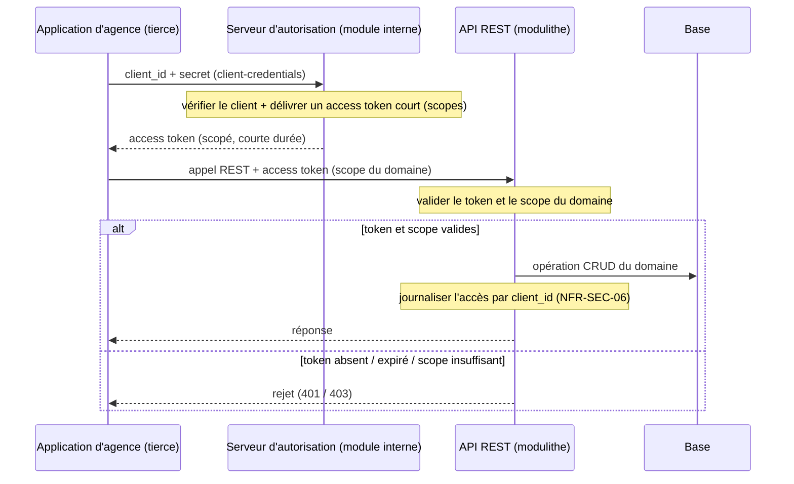

## 8. Intégration des composants tiers

Ce chapitre modélise l'intégration des composants tiers de la cible : leurs protocoles,
la connectivité, la compatibilité avec les choix d'architecture, et la sécurité propre à
l'intégration. Le niveau reste le cadrage.

Le diagramme est en Mermaid et accompagné de son alternative textuelle (ADR-004).

### 8.1 Périmètre — deux composants tiers

La cible intègre exactement deux composants tiers :

1. les applications d'agence tierces, qui consomment notre API (intégration entrante) ;
2. le prestataire de paiement, appelé par notre système et qui nous notifie par webhook
   (intégration sortante et entrante).

Il n'y en a pas d'autre : l'envoi d'e-mails (vérification, réinitialisation, ADR-002) est
spécifié et stubé, non modélisé comme composant tiers ici. Un connecteur de messagerie reste une
évolution possible, sans schéma à ce stade.

**Frontière avec le chapitre 9.** Le présent chapitre traite la sécurité et la compatibilité des
intégrations tierces (authentification machine, webhook signé, TLS des échanges, cohérence des
protocoles). Les bonnes pratiques transverses de toute la cible (remédiation de la dette de
sécurité, accessibilité, écoconception) relèvent du chapitre 9 : ce chapitre y renvoie et ne les
traite pas. La dynamique du paiement est déjà séquencée au chapitre 7 (figure 6) et n'est pas
redessinée ici.

### 8.2 Intégration de l'API agences (entrant)

**Protocole.** REST sur HTTPS (ADR-019), exposant un contrat CRUD par domaine (utilisateur,
réservation, offre, agence, ADR-001). Le contrat est stable par domaine et indépendant de la
technologie du consommateur.

**Authentification machine.** OAuth2 client-credentials avec scopes par domaine (ADR-018),
distincte du RBAC humain (ADR-002) : ce sont deux plans d'autorisation. Une application d'agence
échange son `client_id` / `secret` contre un access token court, puis appelle l'API avec un
scope correspondant au domaine visé.

La figure 9 matérialise ce parcours, la seule dynamique propre au chapitre 8 (ADR-018 la renvoie
explicitement ici).

**Figure 9 — Authentification machine-to-machine d'une application d'agence.**

**Alternative textuelle (Figure 9).** Participants : Application d'agence (tierce), Serveur
d'autorisation (module interne), API REST (modulithe), Base.

Ordre des échanges et point de décision :

1. l'application d'agence présente son `client_id` / `secret` au serveur d'autorisation
   (flux client-credentials) ;
2. le serveur vérifie le client et délivre un access token court, porteur des scopes
   autorisés ;
3. l'application d'agence appelle l'API REST en joignant l'access token, avec le scope du
   domaine visé ;
4. l'API valide le token et le scope, point de décision : s'ils sont valides, l'opération
   CRUD du domaine est exécutée en base, l'accès est journalisé par `client_id` (`NFR-SEC-06`), et
   la réponse est renvoyée. Sinon (token absent / expiré / scope insuffisant), l'appel est
   rejeté (401 / 403).

**Cas métier concret.** La clôture d'une réservation (*confirmée → terminée*) est déclenchée par
une application d'agence via l'API, au retour du véhicule (ADR-014) : c'est un usage direct de ce
contrat (déjà décrit au ch.06 §6.3, non re-séquencé).

**Interopérabilité.** REST et OAuth2 client-credentials sont des standards ubiquitaires : des
applications d'agence hétérogènes (PHP, Java, ou autre) s'intègrent sans couplage technologique,
contre un contrat CRUD stable par domaine. La connectivité est assurée par HTTPS, l'échange de
données par des représentations REST harmonisées.

### 8.3 Intégration du prestataire de paiement (sortant + webhook entrant)

**Sortant.** L'initiation du paiement se fait par redirection vers la page hébergée du prestataire :
la collecte de la carte et l'authentification forte 3-D Secure / DSP2 y sont portées par la
page, hors de notre backend (`NFR-SEC-05`). Les remboursements / compléments passent par
l'API du prestataire et se matérialisent par un `Payment` `charge` / `refund` (ch.06 §6.4,
ADR-011).

**Entrant.** Le webhook de confirmation est authentifié (signature vérifiée avant toute
transition d'état) et idempotent (la référence opaque absorbe les re-livraisons), ADR-021.

**Renvoi au chapitre 7.** La séquence détaillée (réservation → page hébergée → webhook vérifié →
`confirmed`) est la figure 6 ; elle n'est pas redessinée ici.

**Interopérabilité.** Webhooks HTTP signés et API REST du prestataire = protocole standard ;
aucune donnée de carte n'est conservée chez nous (`NFR-SEC-05`). Le mécanisme étant réversible
(ADR-021), un autre prestataire s'intègre sans toucher au modèle.

### 8.4 Compatibilité et absence d'incohérence

Le garde-fou de compatibilité : aucune incohérence entre les composants tiers et les choix retenus.

| Élément d'intégration tierce | Cohérent avec | Décision |
|---|---|---|
| API agences en **REST / HTTPS** | le style d'API et la stack de la cible | ADR-019 / ADR-001 |
| **Webhook** traité dans le **module intégration paiement** | le **modulithe** (composant interne, pas de service séparé) | ADR-003 / ADR-019 |
| **Deux plans d'autorisation** (humain / machine) | RBAC humain + auth machine | ADR-002 / ADR-018 |
| **Page hébergée + API** du prestataire | paiement externalisé, aucune carte stockée | ADR-021 / `NFR-SEC-05` |

Aucune technologie tierce n'impose de pile étrangère à la cible : les protocoles (REST, OAuth2,
webhooks HTTP signés) sont standards et portés nativement par la stack (ADR-019).

### 8.5 Sécurité des intégrations

Volet propre à l'intégration tierce (le transverse est au chapitre 9) :

- **Authentification machine** : tokens courts, secret rotable, scopes par domaine, corrige
  l'esprit d'`AUD-12` (secrets statiques sans rotation) au lieu de le reproduire. Accès journalisés
  par `client_id` (`NFR-SEC-06`) ;
- **Webhook** : signé (vérifié avant transition) et idempotent → non forgeable (ADR-021) ;
- **Transport** : TLS 1.2+ / HTTPS sur tous les échanges tiers ; aucune donnée de carte côté
  backend (`NFR-SEC-05`).

> Le hachage des mots de passe, la gestion générale des secrets et l'analyse des dépendances
> (SCA) sont des bonnes pratiques transverses : elles relèvent du chapitre 9, pas de
> l'intégration tierce.

### 8.6 Rattachement au registre

| Intégration | Décisions et exigences |
|---|---|
| API agences (entrant) | ADR-001 (CRUD par domaine) ; ADR-018 (client-credentials, scopes) ; ADR-002 (distinct du RBAC humain) ; ADR-019 (REST/HTTPS) ; ADR-014 (clôture via API) ; `NFR-SEC-06` |
| Prestataire de paiement (sortant + webhook) | ADR-021 (webhook vérifié, idempotence, réversibilité) ; ch.06 / ADR-011 (`Payment` `charge`/`refund`) ; `NFR-SEC-05` ; `NFR-I18N-02` (devise) |
| Traitement interne du webhook | ADR-003 / ADR-019 (module du modulithe) |

**Anti-sur-ingénierie.** Deux composants tiers, une seule séquence neuve (M2M agences), aucun
re-séquencement du chapitre 7, aucun catalogue de bonnes pratiques transverses (renvoyées au
chapitre 9).
